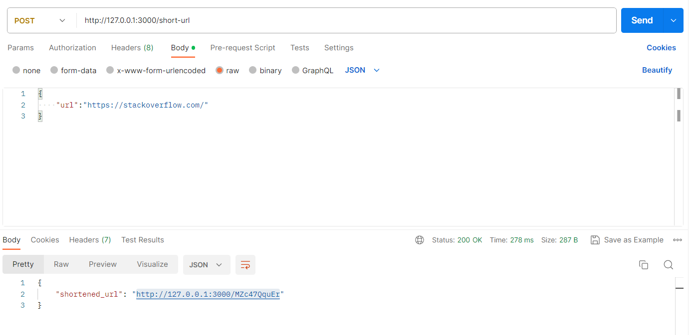

[![Contributors][contributors-shield]][contributors-url]
[![Forks][forks-shield]][forks-url]
[![Stargazers][stars-shield]][stars-url]
[![Issues][issues-shield]][issues-url]
[![LinkedIn][linkedin-shield]][linkedin-url]


  <h3 align="center">URL Shortener</h3>

  <p align="center">
    A URL shortener built using Node.js, Express.js and sqlite3.
    <br />
  </p>


<a name="readme-top"></a>

<details>
  <summary>Table of Contents</summary>
  <ol>
    <li>
      <a href="#about-the-project">About The Project</a>
      <ul>
        <li><a href="#built-with">Built With</a></li>
      </ul>
    </li>
    <li>
      <a href="#getting-started">Getting Started</a>
      <ul>
        <li><a href="#prerequisites">Prerequisites</a></li>
        <li><a href="#installation">Installation</a></li>
          <li><a href="#installation">Start Server</a></li>
      </ul>
    </li>
    <li><a href="#roadmap">Roadmap</a></li>
    <li><a href="#contributing">Contributing</a></li>
    <li><a href="#license">License</a></li>
    <li><a href="#contact">Contact</a></li>
  </ol>
</details>


## About The Project



A URL shortening service API from scratch. You can integrate it with any frontend you want, and even build a full-stack URL shortener service.

<p align="right">(<a href="#readme-top">back to top</a>)</p>


### Built With

This section should list any major frameworks/libraries used.

* [![Node][Node.js]][nodejs-url]
* [![Express][Express.js]][Expressjs-url]
* [![][node-sqlite]][node-sqlite3-url]

<p align="right">(<a href="#readme-top">back to top</a>)</p>

## Getting Started

### Prerequisites

This is an example of how to list things you need to use the software and how to install them.
* [Node.js](https://nodejs.org/en)

### Installation

_Below is an example of how you can instruct your audience on installing and setting up your app. This template doesn't rely on any external dependencies or services._

2. Clone the repo
   ```sh
   git clone https://github.com/hx00r/url-shortener
   ```
   
3. Install NPM packages
   ```sh
   npm install
   ```

### Start the server

You need to run the below command in order to start the server.

1. run the following command.

   ```sh
   npm start
   ```

<p align="right">(<a href="#readme-top">back to top</a>)</p>

## Roadmap

- [ ] add user login and register to create URLs.
- [ ] make URLs data private to only the owner of the URLs

See the [open issues](https://github.com/hx00r/url-shortener/issues) for a full list of proposed features (and known issues).

<p align="right">(<a href="#readme-top">back to top</a>)</p>

## Contributing

Contributions are what make the open source community such an amazing place to learn, inspire, and create. Any contributions you make are **greatly appreciated**.

If you have a suggestion that would make this better, please fork the repo and create a pull request. You can also simply open an issue with the tag "enhancement".
Don't forget to give the project a star! Thanks again!

1. Fork the Project
2. Create your Feature Branch (`git checkout -b feature/AmazingFeature`)
3. Commit your Changes (`git commit -m 'Add some AmazingFeature'`)
4. Push to the Branch (`git push origin feature/AmazingFeature`)
5. Open a Pull Request

<p align="right">(<a href="#readme-top">back to top</a>)</p>


## License

Distributed under the MIT License. See `LICENSE.txt` for more information.

<p align="right">(<a href="#readme-top">back to top</a>)</p>

## Contact

Your Name - [Linkedin](https://www.linkedin.com/in/hx00r/) - hx00rr@gmail.com

Project Link: [https://github.com/hx00r/url-shortener](https://github.com/hx00r/url-shortener)

<p align="right">(<a href="#readme-top">back to top</a>)</p>


[contributors-shield]: https://img.shields.io/github/contributors/hx00r/qrcode-generator?style=for-the-badge
[contributors-url]: https://github.com/hx00r/qrcode-generator/graphs/contributors
[forks-shield]: https://img.shields.io/github/forks/hx00r/qrcode-generator?style=for-the-badge
[forks-url]: https://github.com/hx00r/qrcode-generator/network/members
[stars-shield]: https://img.shields.io/github/stars/hx00r/qrcode-generator?style=for-the-badge
[stars-url]: https://github.com/hx00r/qrcode-generator/stargazers
[issues-shield]: https://img.shields.io/github/issues/hx00r/qrcode-generator?style=for-the-badge
[issues-url]: https://github.com/hx00r/qrcode-generator/issues
[license-shield]: https://img.shields.io/github/license/othneildrew/Best-README-Template.svg?style=for-the-badge
[license-url]: https://github.com/othneildrew/Best-README-Template/blob/master/LICENSE.txt
[linkedin-shield]: https://img.shields.io/badge/-LinkedIn-black.svg?style=for-the-badge&logo=linkedin&colorB=555
[linkedin-url]: https://www.linkedin.com/in/hx00r/
[product-screenshot]: images/screenshot.png
[Next.js]: https://img.shields.io/badge/next.js-000000?style=for-the-badge&logo=nextdotjs&logoColor=white
[Next-url]: https://nextjs.org/
[React.js]: https://img.shields.io/badge/React-20232A?style=for-the-badge&logo=react&logoColor=61DAFB
[React-url]: https://reactjs.org/
[Vue.js]: https://img.shields.io/badge/Vue.js-35495E?style=for-the-badge&logo=vuedotjs&logoColor=4FC08D
[Vue-url]: https://vuejs.org/
[Angular.io]: https://img.shields.io/badge/Angular-DD0031?style=for-the-badge&logo=angular&logoColor=white
[Angular-url]: https://angular.io/
[Svelte.dev]: https://img.shields.io/badge/Svelte-4A4A55?style=for-the-badge&logo=svelte&logoColor=FF3E00
[Svelte-url]: https://svelte.dev/
[Laravel.com]: https://img.shields.io/badge/Laravel-FF2D20?style=for-the-badge&logo=laravel&logoColor=white
[Laravel-url]: https://laravel.com
[Bootstrap.com]: https://img.shields.io/badge/Bootstrap-563D7C?style=for-the-badge&logo=bootstrap&logoColor=white
[Bootstrap-url]: https://getbootstrap.com
[JQuery.com]: https://img.shields.io/badge/jQuery-0769AD?style=for-the-badge&logo=jquery&logoColor=white
[JQuery-url]: https://jquery.com
[Expressjs-url]: https://expressjs.com/
[Express.js]: https://img.shields.io/badge/express.js-000000?style=for-the-badge&amp;logo=nextdotjs&amp;logoColor=white
[nodejs-url]: https://nodejs.org/en
[Node.js]: https://img.shields.io/badge/node.js-green?style=for-the-badge&amp;logo=nextdotjs&amp;logoColor=white

[node-sqlite]: https://img.shields.io/badge/node--sqlite3-green?style=for-the-badge&amp;amp;logo=nextdotjs&amp;amp;logoColor=white
[node-sqlite3-url]: https://www.npmjs.com/package/sqlite3


[node-sqlite-url]: 